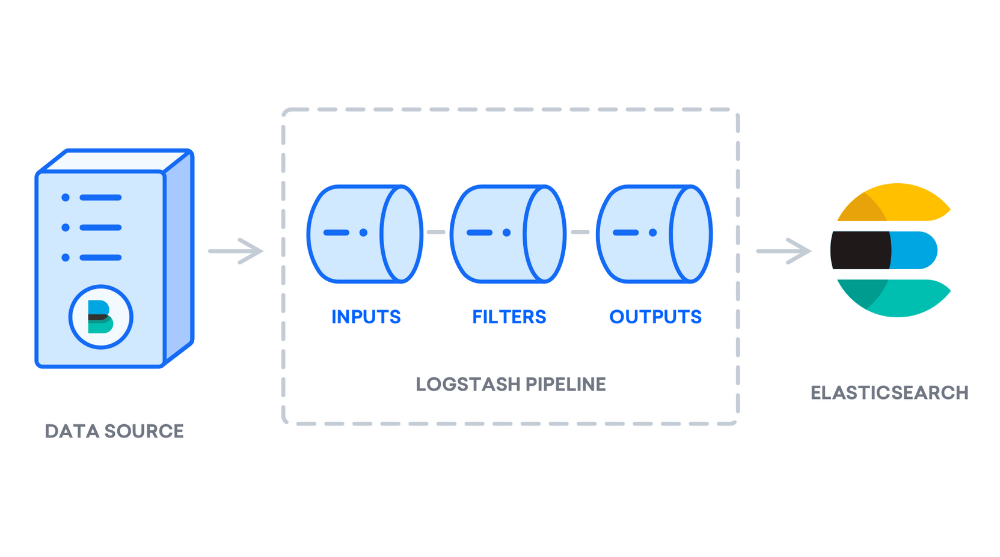

**Course Title:**
Logstash & ELK Essentials: A Beginner's Guide

**Subtitle:**
Learn the basics of Logstash, ELK stack, and how Elasticsearch, Logstash, and Kibana work together for data processing.

**Course Description:**
Are you ready to dive into the world of data processing and log management? This course, "Logstash & ELK Essentials: A Beginner's Guide," is designed to equip you with the foundational knowledge and skills to harness the power of Logstash and the ELK stack.

**What is Logstash?**
Logstash is a versatile data processing pipeline tool that enables you to ingest, transform, and store data from a multitude of sources. Whether you're dealing with log data, metrics, or any other type of structured or unstructured data, Logstash allows you to centralize data processing, making it easier to manage and analyze.

**Purpose and Benefits of Logstash:**
- **Centralized Data Processing:** Streamline your data from various sources into a single pipeline for consistent processing.
- **Real-Time Log Analysis:** Gain immediate insights by analyzing log data as it is ingested.
- **Flexible Data Transformation:** Use powerful filters to parse, transform, and enrich your data.
- **Seamless Integration:** Connect with various data outputs, including Elasticsearch, databases, and more.

**What is the ELK Stack?**
The ELK stack, comprising Elasticsearch, Logstash, and Kibana, is a powerful suite of tools for searching, analyzing, and visualizing log data in real-time.

**Why Use the ELK Stack?**
- **Scalability:** Handle large volumes of data effortlessly.
- **Flexibility:** Adapt the stack to various use cases and data types.
- **Powerful Data Analysis:** Leverage Elasticsearch for efficient search and analysis.
- **User-Friendly Visualization:** Use Kibana to create intuitive dashboards and visualizations.

**Basic Requirements:**
- **Computer Literacy:** Basic understanding of using a computer and navigating the internet.
- **System Access:** A computer with internet access and the ability to install software.

**Optional Technical Skills:**
- **Basic Knowledge of Command Line:** Familiarity with using command-line interfaces.
- **Understanding of JSON:** Basic comprehension of JSON formatting and structure.
- **Networking Concepts:** Basic understanding of networking and data flow.

**Optional Soft Skills:**
- **Analytical Thinking:** Ability to analyze data and troubleshoot issues.
- **Attention to Detail:** Keen eye for detail when configuring and managing data pipelines.
- **Problem-Solving:** Strong problem-solving skills for diagnosing and resolving data processing issues.

**Who Should Attend This Course:**
- **IT Professionals:** Individuals working in IT infrastructure, operations, or support roles.
- **Data Analysts:** Professionals looking to enhance their data processing and analysis capabilities.
- **Developers:** Developers interested in integrating log management and analysis into their applications.
- **System Administrators:** Administrators responsible for maintaining and monitoring server logs.
- **Students:** Anyone interested in learning about data processing and log management tools.

**This Course Is For:**
- **Beginners:** Individuals with no prior experience in Logstash or the ELK stack.
- **Career Changers:** Professionals looking to transition into roles involving data processing and analysis.
- **Enhancers:** Existing professionals seeking to broaden their skill set with log management and data visualization tools.

Throughout this course, you will explore the core components of the ELK stack and how they interact with each other. You will learn the essentials of setting up and configuring Logstash, integrating it with Elasticsearch and Kibana, and applying best practices for data processing and log management.

By the end of this course, you will have a solid understanding of Logstash and the ELK stack, empowering you to effectively manage, analyze, and visualize your data. Whether you are an IT professional, a data analyst, or simply someone interested in log management, this course will provide you with the skills needed to leverage these powerful tools in your work.

Tips/Tricks/Notes/Commands URL Link: https://github.com/nimaxnimax/Udemy_ELK.git

Instructor & Courses >> https://www.udemy.com/user/adrian-fischer-infotech/


**********


Installation Commands URL Link >> https://github.com/nimaxnimax/Udemy_ELK/tree/main/Logstash_ELK_Essentials_Beginner_Guide

How To Install Elasticsearch, Logstash, and Kibana (Elastic Stack) on Ubuntu 22.04

Step 1 — Installing and Configuring Elasticsearch

The Elasticsearch components are not available in Ubuntu’s default package repositories. They can, however, be installed with APT after adding Elastic’s package source list.

All of the packages are signed with the Elasticsearch signing key in order to protect your system from package spoofing. Packages which have been authenticated using the key will be considered trusted by your package manager. In this step, you will import the Elasticsearch public GPG key and add the Elastic package source list in order to install Elasticsearch.

To begin, use cURL, the command line tool for transferring data with URLs, to import the Elasticsearch public GPG key into APT. Note that we are using the arguments -fsSL to silence all progress and possible errors (except for a server failure) and to allow cURL to make a request on a new location if redirected. Pipe the output of the curl command to the gpg --dearmor command, which converts the key into a format that apt can use to verify downloaded packages.

```bash
curl -fsSL https://artifacts.elastic.co/GPG-KEY-elasticsearch |sudo gpg --dearmor -o /usr/share/keyrings/elastic.gpg
```

Next, add the Elastic source list to the sources.list.d directory, where APT will search for new sources:

```bash
echo "deb [signed-by=/usr/share/keyrings/elastic.gpg] https://artifacts.elastic.co/packages/7.x/apt stable main" | sudo tee -a /etc/apt/sources.list.d/elastic-7.x.list
```

The [signed-by=/usr/share/keyrings/elastic.gpg] portion of the file instructs apt to use the key that you downloaded to verify repository and file information for Elasticsearch packages.

Next, update your package lists so APT will read the new Elastic source:

```bash
sudo apt update -y
```

Then install Elasticsearch with this command:

```bash
sudo apt install elasticsearch -y
```

Elasticsearch is now installed and ready to be configured. Use your preferred text editor to edit Elasticsearch’s main configuration file, elasticsearch.yml. Here, we’ll use nano:

```bash
sudo nano /etc/elasticsearch/elasticsearch.yml
```

Note: Elasticsearch’s configuration file is in YAML format, which means that we need to maintain the indentation format. Be sure that you do not add any extra spaces as you edit this file.

The elasticsearch.yml file provides configuration options for your cluster, node, paths, memory, network, discovery, and gateway. Most of these options are preconfigured in the file but you can change them according to your needs. For the purposes of our demonstration of a single-server configuration, we will only adjust the settings for the network host.

Elasticsearch listens for traffic from everywhere on port 9200. You will want to restrict outside access to your Elasticsearch instance to prevent outsiders from reading your data or shutting down your Elasticsearch cluster through its [REST API]. To restrict access and therefore increase security, find the line that specifies network.host, uncomment it, and replace its value with localhost like this:

```bash
/etc/elasticsearch/elasticsearch.yml
. . .
# ---------------------------------- Network -----------------------------------
#
# Set the bind address to a specific IP (IPv4 or IPv6):
#
network.host: localhost
. . .
```

We have specified localhost so that Elasticsearch listens on all interfaces and bound IPs. If you want it to listen only on a specific interface, you can specify its IP in place of localhost. Save and close elasticsearch.yml. If you’re using nano, you can do so by pressing CTRL+X, followed by Y and then ENTER .

These are the minimum settings you can start with in order to use Elasticsearch. Now you can start Elasticsearch for the first time.

Start the Elasticsearch service with systemctl. Give Elasticsearch a few moments to start up. Otherwise, you may get errors about not being able to connect.

```bash
sudo systemctl start elasticsearch
```

Next, run the following command to enable Elasticsearch to start up every time your server boots:

```bash
sudo systemctl enable elasticsearch
```

You can test whether your Elasticsearch service is running by sending an HTTP request:

```bash
curl -X GET "localhost:9200"
```

You will see a response showing some basic information about your local node, similar to this:

```bash
Output
{
  "name" : "Elasticsearch",
  "cluster_name" : "elasticsearch",
  "cluster_uuid" : "n8Qu5CjWSmyIXBzRXK-j4A",
  "version" : {
    "number" : "7.17.2",
    "build_flavor" : "default",
    "build_type" : "deb",
    "build_hash" : "de7261de50d90919ae53b0eff9413fd7e5307301",
    "build_date" : "2022-03-28T15:12:21.446567561Z",
    "build_snapshot" : false,
    "lucene_version" : "8.11.1",
    "minimum_wire_compatibility_version" : "6.8.0",
    "minimum_index_compatibility_version" : "6.0.0-beta1"
  },
  "tagline" : "You Know, for Search"
}
```

Now that Elasticsearch is up and running, let’s install Kibana, the next component of the Elastic Stack.


**********


You can check all information related to this course on github.com and for more information about the tips tricks notes commands and everything check the github url link and the repository that I show you. 

Tips/Tricks/Notes/Commands URL Link: https://github.com/nimaxnimax/Udemy_ELK.git


Step 2 — Installing and Configuring the Kibana Dashboard

According to the official documentation, you should install Kibana only after installing Elasticsearch. Installing in this order ensures that the components each product depends on are correctly in place.

Because you’ve already added the Elastic package source in the previous step, you can just install the remaining components of the Elastic Stack using apt:

```bash
sudo apt install kibana -y
```


Then enable and start the Kibana service:

```bash
sudo systemctl enable kibana
```

```bash
sudo systemctl start kibana

```


If you’re unsure about the correct service name, you can list available services:

```bash
sudo service --status-all
```


Check Systemd Status:

```bash
systemctl status kibana
```


If it’s not recognized, you might need to reload the systemd daemon or manually enable the service:

```bash
sudo systemctl daemon-reload
```

```bash
sudo systemctl enable kibana

```


Check Kibana Configuration:

Verify that Kibana is configured to listen on all network interfaces (0.0.0.0) so that it can accept connections from external machines. Open the Kibana configuration file (/etc/kibana/kibana.yml) and ensure that the server.host option is set to:

```bash
sudo nano /etc/kibana/kibana.yml
```

```bash
server.host: "0.0.0.0"
```


Verify Elasticsearch Connection:

Kibana requires a functional connection to Elasticsearch. Ensure that Elasticsearch is running and properly configured. Verify that the Elasticsearch URL is correctly set in the Kibana configuration file (/etc/kibana/kibana.yml):

```bash
elasticsearch.hosts: ["http://localhost:9200"]
```


After making changes, restart the Kibana service:

```bash
sudo service kibana restart
```


**********


Step 3 — Installing and Configuring Logstash

Although it’s possible for Beats to send data directly to the Elasticsearch database, it is common to use Logstash to process the data. This will allow you more flexibility to collect data from different sources, transform it into a common format, and export it to another database.


Install Logstash with this command:

```bash
sudo apt install logstash -y
```


After installing Logstash, you can move on to configuring it. Logstash’s configuration files reside in the /etc/logstash/conf.d directory. For more information on the configuration syntax, you can check out the configuration reference that Elastic provides. As you configure the file, it’s helpful to think of Logstash as a pipeline which takes in data at one end, processes it in one way or another, and sends it out to its destination (in this case, the destination being Elasticsearch). A Logstash pipeline has two required elements, input and output, and one optional element, filter. The input plugins consume data from a source, the filter plugins process the data, and the output plugins write the data to a destination.

https://www.elastic.co/guide/en/logstash/current/configuration-file-structure.html





Create a configuration file called 02-beats-input.conf where you will set up your Filebeat input:

```bash
sudo nano /etc/logstash/conf.d/02-beats-input.conf
```


Insert the following input configuration. This specifies a beats input that will listen on TCP port 5044.

```bash
input {
  beats {
    port => 5044
  }
}
```

Save and close the file.


Next, create a configuration file called 30-elasticsearch-output.conf:

```bash
sudo nano /etc/logstash/conf.d/30-elasticsearch-output.conf
```


Insert the following output configuration. Essentially, this output configures Logstash to store the Beats data in Elasticsearch, which is running at localhost:9200, in an index named after the Beat used. The Beat used in this tutorial is Filebeat:

```bash
output {
  if [@metadata][pipeline] {
	elasticsearch {
  	hosts => ["localhost:9200"]
  	manage_template => false
  	index => "%{[@metadata][beat]}-%{[@metadata][version]}-%{+YYYY.MM.dd}"
  	pipeline => "%{[@metadata][pipeline]}"
	}
  } else {
	elasticsearch {
  	hosts => ["localhost:9200"]
  	manage_template => false
  	index => "%{[@metadata][beat]}-%{[@metadata][version]}-%{+YYYY.MM.dd}"
	}
  }
}
```

Save and close the file.


Test your Logstash configuration with this command:

```bash
sudo -u logstash /usr/share/logstash/bin/logstash --path.settings /etc/logstash -t
```

If there are no syntax errors, your output will display Config Validation Result: OK. Exiting Logstash after a few seconds. If you don’t see this in your output, check for any errors noted in your output and update your configuration to correct them. Note that you will receive warnings from OpenJDK, but they should not cause any problems and can be ignored.


If your configuration test is successful, start and enable Logstash to put the configuration changes into effect:

```bash
sudo systemctl start logstash
```

```bash
sudo systemctl enable logstash
```

Now that Logstash is running correctly and is fully configured, let’s install Filebeat.


**********


Step 4 — Installing and Configuring Filebeat

The Elastic Stack uses several lightweight data shippers called Beats to collect data from various sources and transport them to Logstash or Elasticsearch. Here are the Beats that are currently available from Elastic:

Filebeat: collects and ships log files.

Metricbeat: collects metrics from your systems and services.

Packetbeat: collects and analyzes network data.

Winlogbeat: collects Windows event logs.

Auditbeat: collects Linux audit framework data and monitors file integrity.

Heartbeat: monitors services for their availability with active probing.


In this tutorial we will use Filebeat to forward local logs to our Elastic Stack.

Install Filebeat using apt:

```bash
sudo apt install filebeat -y
```


Next, configure Filebeat to connect to Logstash. Here, we will modify the example configuration file that comes with Filebeat.

Open the Filebeat configuration file:

```bash
sudo nano /etc/filebeat/filebeat.yml
```


Note: As with Elasticsearch, Filebeat’s configuration file is in YAML format. This means that proper indentation is crucial, so be sure to use the same number of spaces that are indicated in these instructions.

Filebeat supports numerous outputs, but you’ll usually only send events directly to Elasticsearch or to Logstash for additional processing. In this tutorial, we’ll use Logstash to perform additional processing on the data collected by Filebeat. Filebeat will not need to send any data directly to Elasticsearch, so let’s disable that output. To do so, find the output.elasticsearch section and comment out the following lines by preceding them with a #:

```bash
...
#output.elasticsearch:
  # Array of hosts to connect to.
  #hosts: ["localhost:9200"]
...
```


Then, configure the output.logstash section. Uncomment the lines output.logstash: and hosts: ["localhost:5044"] by removing the #. This will configure Filebeat to connect to Logstash on your Elastic Stack server at port 5044, the port for which we specified a Logstash input earlier:

```bash
output.logstash:
  # The Logstash hosts
  hosts: ["localhost:5044"]
```


Save and close the file.

The functionality of Filebeat can be extended with Filebeat modules. In this tutorial we will use the system module, which collects and parses logs created by the system logging service of common Linux distributions.

Let’s enable it:

```bash
sudo filebeat modules enable system
```

You can see a list of enabled and disabled modules by running:

```bash
sudo filebeat modules list
```


You will see a list similar to the following:

```bash
Output
Enabled:
system

Disabled:
apache2
auditd
elasticsearch
icinga
iis
kafka
kibana
logstash
mongodb
mysql
nginx
osquery
postgresql
redis
traefik
...
```


By default, Filebeat is configured to use default paths for the syslog and authorization logs. In the case of this tutorial, you do not need to change anything in the configuration. You can see the parameters of the module in the /etc/filebeat/modules.d/system.yml configuration file.

Next, we need to set up the Filebeat ingest pipelines, which parse the log data before sending it through logstash to Elasticsearch. To load the ingest pipeline for the system module, enter the following command:

```bash
sudo filebeat setup --pipelines --modules system
```


Next, load the index template into Elasticsearch. An Elasticsearch index is a collection of documents that have similar characteristics. Indexes are identified with a name, which is used to refer to the index when performing various operations within it. The index template will be automatically applied when a new index is created.

To load the template, use the following command:

```bash
sudo filebeat setup --index-management -E output.logstash.enabled=false -E 'output.elasticsearch.hosts=["localhost:9200"]'
```

Filebeat comes packaged with sample Kibana dashboards that allow you to visualize Filebeat data in Kibana. Before you can use the dashboards, you need to create the index pattern and load the dashboards into Kibana.

As the dashboards load, Filebeat connects to Elasticsearch to check version information. To load dashboards when Logstash is enabled, you need to disable the Logstash output and enable Elasticsearch output:

```bash
sudo filebeat setup -E output.logstash.enabled=false -E output.elasticsearch.hosts=['localhost:9200'] -E setup.kibana.host=localhost:5601
```

After a few minutes, you should receive output similar to this:

```bash
Output
Overwriting ILM policy is disabled. Set `setup.ilm.overwrite:true` for enabling.

Index setup finished.
Loading dashboards (Kibana must be running and reachable)
Loaded dashboards
Setting up ML using setup --machine-learning is going to be removed in 8.0.0. Please use the ML app instead.
See more: https://www.elastic.co/guide/en/elastic-stack-overview/current/xpack-ml.html
Loaded machine learning job configurations
Loaded Ingest pipelines
```


Now you can start and enable Filebeat:

```bash
sudo systemctl start filebeat
```

```bash
sudo systemctl enable filebeat
```

If you’ve set up your Elastic Stack correctly, Filebeat will begin shipping your syslog and authorization logs to Logstash, which will then load that data into Elasticsearch.

To verify that Elasticsearch is indeed receiving this data, query the Filebeat index with this command:

```bash
curl -XGET 'http://localhost:9200/filebeat-*/_search?pretty'
```

You should receive output similar to this:

```bash
Output
. . .
{
  "took" : 4,
  "timed_out" : false,
  "_shards" : {
    "total" : 2,
    "successful" : 2,
    "skipped" : 0,
    "failed" : 0
  },
  "hits" : {
    "total" : {
      "value" : 4040,
      "relation" : "eq"
    },
    "max_score" : 1.0,
    "hits" : [
      {
        "_index" : "filebeat-7.17.2-2022.04.18",
        "_type" : "_doc",
        "_id" : "YhwePoAB2RlwU5YB6yfP",
        "_score" : 1.0,
        "_source" : {
          "cloud" : {
            "instance" : {
              "id" : "294355569"
            },
            "provider" : "digitalocean",
            "service" : {
              "name" : "Droplets"
            },
            "region" : "tor1"
          },
          "@timestamp" : "2022-04-17T04:42:06.000Z",
          "agent" : {
            "hostname" : "elasticsearch",
            "name" : "elasticsearch",
            "id" : "b47ca399-e6ed-40fb-ae81-a2f2d36461e6",
            "ephemeral_id" : "af206986-f3e3-4b65-b058-7455434f0cac",
            "type" : "filebeat",
            "version" : "7.17.2"
          },
. . .
```


If your output shows 0 total hits, Elasticsearch is not loading any logs under the index you searched for, and you will need to review your setup for errors. If you received the expected output, continue to the next step, in which we will see how to navigate through some of Kibana’s dashboards.


**********

